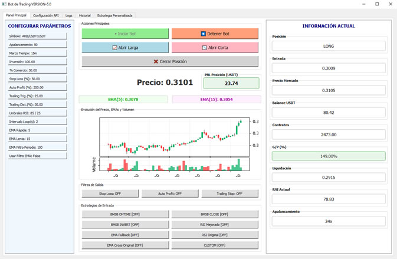
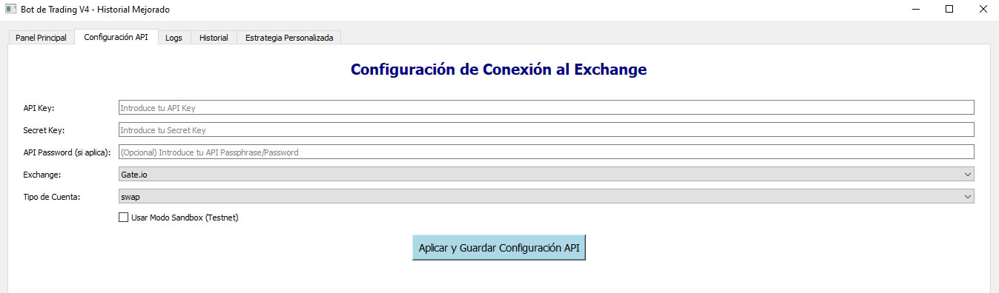
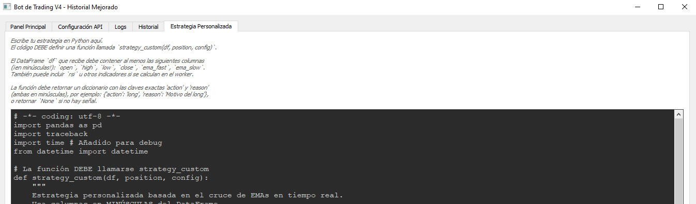

# 🤖 BOT DE TRADING V5.0 - PyQt5 + CCXT

[](https://www.python.org/)
[](https://pypi.org/project/PyQt5/)
[](LICENSE)

---

# 📚 Tabla de Contenidos
- [Descripción](#-descripción)
- [Vista previa](#-vista-previa-de-la-aplicación)
- [Características principales](#-características-principales)
- [Instalación y requisitos](#-instalación-y-requisitos)
- [Uso detallado](#-uso-detallado)
- [Crear tu propia estrategia](#-crear-tu-propia-estrategia)
- [Tecnologías utilizadas](#-tecnologías-utilizadas)
- [Licencia](#-licencia)
- [Agradecimientos](#-agradecimientos)

---

## 📚 Descripción

**BOT DE TRADING V5.0** es un bot automático para criptomonedas que combina la facilidad de una interfaz **PyQt5** con la potencia de **CCXT**.

- Operaciones automáticas en exchanges.
- Filtros de protección: Stop Loss, Take Profit, Trailing Stop.
- Editor para estrategias propias.

Ideal para traders que desean automatizar sin complicaciones.

---

## 📸 Vista previa de la aplicación

### Panel Principal del Bot


### Configuración del Exchange


### Editor de Estrategia Personalizada


---

## ✨ Características principales

- ✅ GUI profesional en PyQt5.
- 🔐 Múltiples exchanges soportados mediante CCXT.
- 📈 Estrategias: RSI, EMAs, Pullback, Personalizadas.
- 🛡️ Stop Loss, Take Profit, Trailing Stop.
- 📅 Exportación de historial a Excel.
- 🔄 Recarga dinámica de configuración.
- 💬 Logs en tiempo real.

---

## ⚙️ Instalación y requisitos

### Requisitos

- Python 3.8 o superior
- PyQt5
- ccxt
- pandas
- openpyxl

### Instalación rápida

```bash
pip install -r requirements.txt
```

---

## 🚀 Uso detallado

### Ejecución del bot

```bash
python main.py
```

> ⚡ Si ves errores de permisos en Windows, ejecuta como administrador o usa un entorno virtual.

---

## 🧠 Crear tu propia estrategia

Desde la pestaña **"Estrategia Personalizada"**, puedes escribir en vivo código como este:

```python
def strategy_custom(df, position, config):
    if df['close'].iloc[-1] > df['open'].iloc[-1]:
        return {'action': 'long', 'reason': 'Vela alcista'}
    return None
```

> Esta estrategia se usará automáticamente si activas la opción `CUSTOM`.

---

## 💪 Tecnologías utilizadas

- [Python 3.9](https://www.python.org/)
- [PyQt5](https://pypi.org/project/PyQt5/)
- [pandas](https://pandas.pydata.org/)
- [ccxt](https://github.com/ccxt/ccxt)
- [openpyxl](https://openpyxl.readthedocs.io/)

---

## 💜 Licencia

Este proyecto está bajo licencia **MIT**. Consulta el archivo [LICENSE](LICENSE) para más detalles.

---

## 👋 Agradecimientos

- A [ccxt](https://github.com/ccxt/ccxt) por su gran librería multi-exchange.
- A la comunidad de PyQt5 y pandas.

---

> Desarrollado con ❤️ por TradeAIcode.

---


